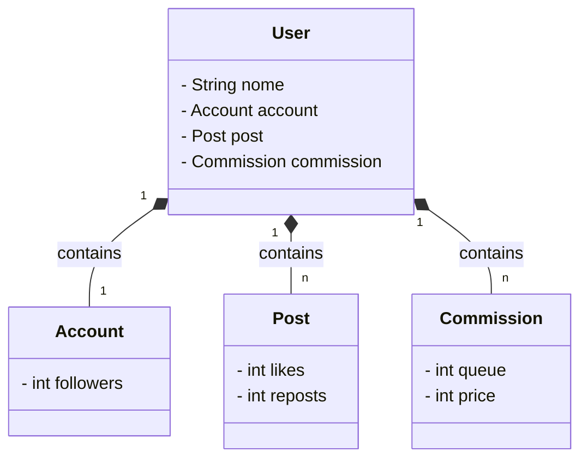

## Santander dev week

Projeto de API RESTful usando Spring Boot criada para o Bootcamp Java da DIO, simulando uma conta de arte em uma rede social

```mermaid
classDiagram
    class User {
        - String nome
        - Account account
        - Post post
        - Commission commission
    }
    
    class Account {
        - int followers
    }
    
    class Post {
        - int likes
        - int reposts
    }
    
    class Commission {
        - int queue
        - int price
    }
    
    User "1"*-- "1" Account : contains
    User "1"*-- "n" Post : contains
    User "1"*-- "n" Commission : contains
```
